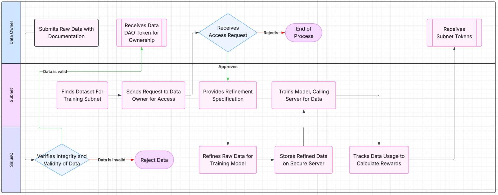

# Submission Draft (Replace with name)

## Documentation

Welcome to QuantumDataDAO, the largested compiled source of private and public databases being used to accelerate the progress of hybrid and pure quantum machine learning research. Our mission is to build a collaborative ecosystem for researchers and builders to pursue innovation in the field of quantum computing without the restriction of data access. We encourage labs and those with quantum data to contribute their data to be used for training in our hybrid quantum engine subnets at SiriusQ.

## Data Usage and Rewards

Once submitted, your raw data will be stored securely and controlled by a QuantumDataDAO token which you will be given ownership. Subnets can submit requests to train their models on your data, and after reviewing their subnet you can decide on whether or not they are given access.

If you agree, your data will be refined into a suitable format to be fed directly into the subnet's model for training. All data (including refined) is stored securely on the SiriusQ server, where subnets can make calls to access parts of the data for training. Subnets will never be able to download or reveal any data, but only use it to train their models, ensuring your data stays private under your ownership.

Depending on the subnets usage of your data, you will be rewarded with a proportionate amount of subnet tokens. This flowchart shows a simplified structure of how your data will be moved around:

## Submission Guidelines

### Example Data Types
- **Quantum Computing Experiments**: Results from quantum computing experiments in areas such as error correction and combinatorial optimization
- **Quantum Systems**: Evolution of a quantum system, for example how the states qubits change with operations from quantum gates in quantum computing
- **Laboratory Experimens**: Data from labs, such as electron spins of chemical compounds
- **Quantum Encoded Data**: Classical data that has been encoded into a qauntum state

This includes only a very small sample of possible datasets the DAO would benefit from holding. As each submission is reviewed independently, we encourage everyone to submit an application for any datasets they think fit into our criteria.

### Submission Components
1. **Format**: Data submitted can be in its raw form, as it will be refined for subnet training
2. **Documentation**: Include comprehensive documentation explaining how the data was gathered, how the raw data is organised and also its application and intended field of research. This will be made public to subnets, acting as an advert for your data
5. **Metadata file**: A file containing data paths for features that may be labelled. Depends on the complexity and how the data is organised in its raw form

### How to Submit
1. Fork the repository
2. Clone the submission draft branch, renaming it as your dataset
3. Update the contents appropriately
5. Submit a pull request
6. Wait for community review and approval

### Review Process
- All submissions are verified by the SiriusQ team, and then reviewed by the community
- The community will only have access to the documentation, and not the raw data or metadata files
- The majority of community voters (50%) must agree for the data to be added to the DAO
- Criteria for acceptance is not dependent on significance of data, but accuracy and originality

## What is Refinement?

Due to the hybrid nature of subnet models, it is nearly impossible to determine a format of data which can be used efficiently in every single subnet when training. As such, when a subnet requests to access a raw dataset from the QuantumDataDAO, SiriusQ refines the raw data into a format that can be directly parsed into the model for training. This structure will vary from subnet to subnet, and so must be done one case-to-case basis.

Any refinement will be done on the SiriusQ server, before being stored as refined data only be to accessed in small parts and hidden from the subnet operator when called to be used in training. The refinement process requires nothing from the data owner.

## Contributing

N/A

## License

N/A

## Contact

- **Discord**: [Join our Discord server](n/A)
- **Email**: info@siriusquantum.com
- **Twitter**: [@QuantumDataDAO](N/A)